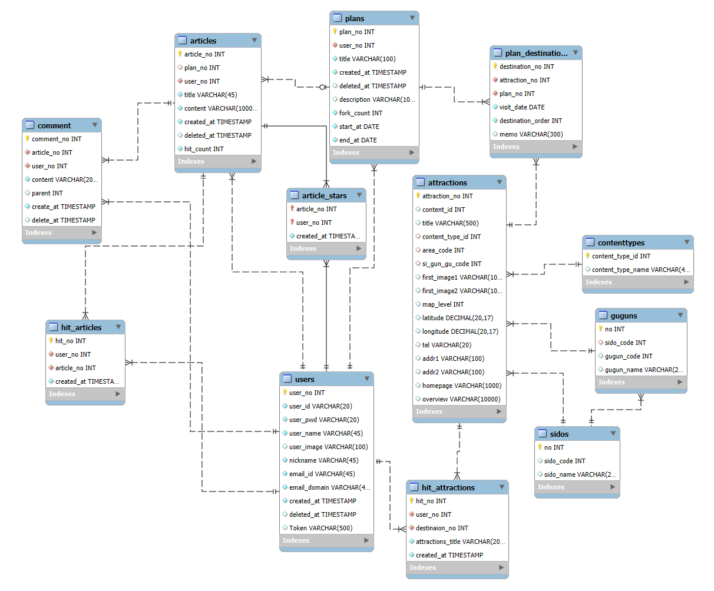
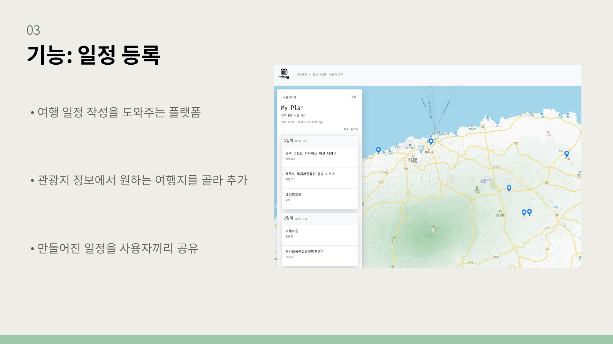
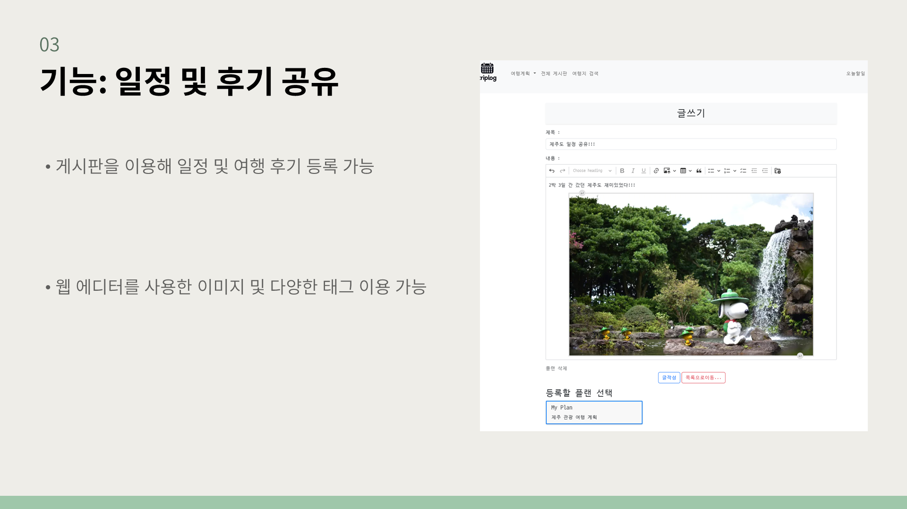
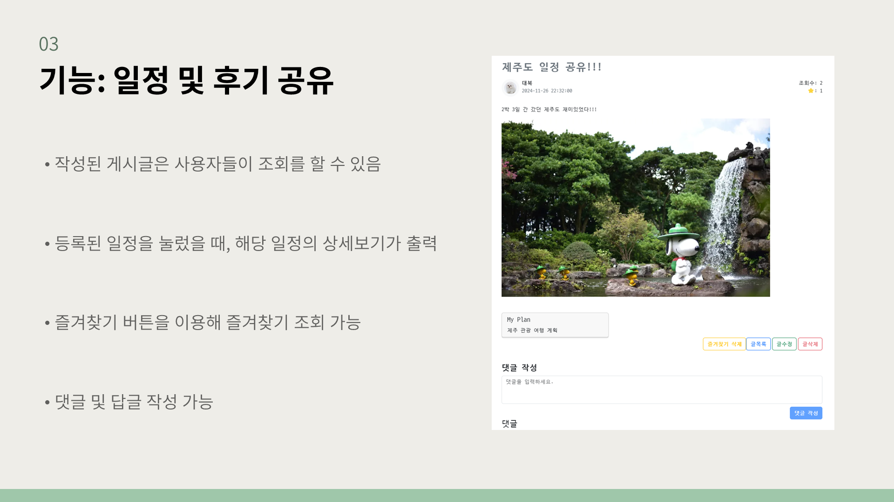
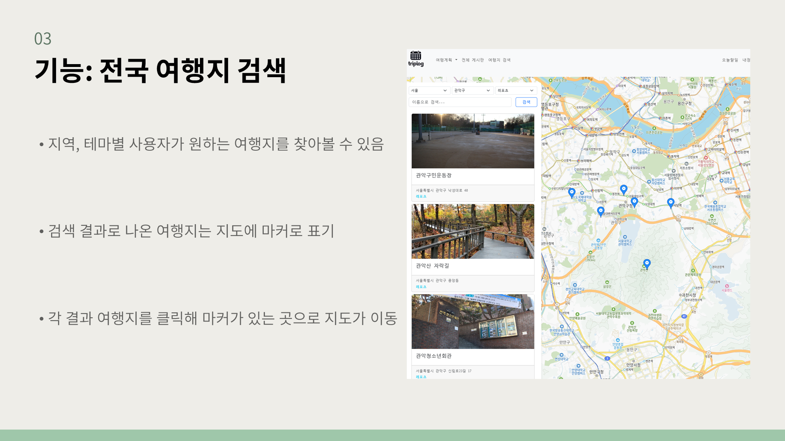
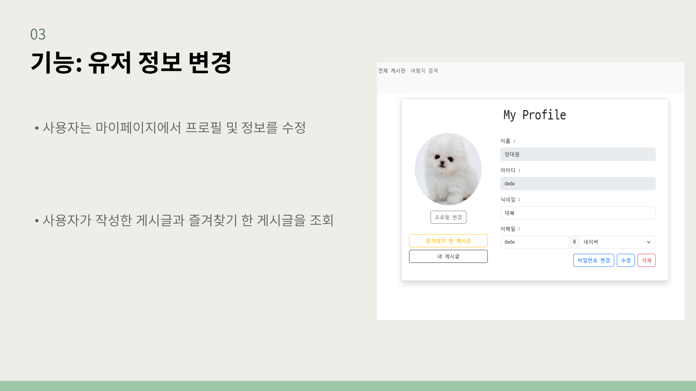
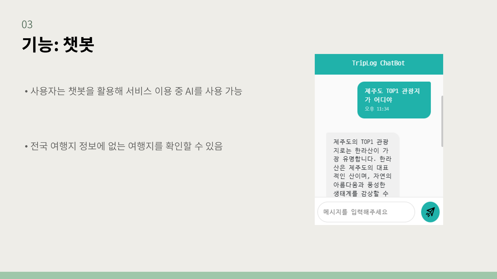

# ✈ TripLog README

 

## 프로젝트 소개
- 여행 일정 작성을 도와주는 플랫폼입니다.
- 관광지 정보에서 원하는 여행지를 골라 추가하여 손쉽게 여행 일정을 만들 수 있습니다.
- 만들어진 일정을 사용자끼리 공유하며 다른 사람의 여행 일정을 구경하고 후기를 볼 수 있습니다.

 

## 팀원 구성
[양대원(YDaewon)](https://github.com/YDaewon)  
[김휘동(HwiDong6831)](https://github.com/HwiDong6831)

 

## 1. 개발 환경

- Front : HTML, JavaScript, Vue3, BootStrap, Vite
- Back-end : Java, SpringBoot, MyBatis
- DB : MySQL
- 버전 및 이슈관리 : Github, Github Project
- 협업 툴 : Notion, Discord
- 서비스 배포 환경 : 
- 디자인 : [Figma](https://www.figma.com/design/s91JHntpcqEDq76bNRXN6F/Untitled?node-id=0-1&node-type=canvas&t=qc5gZoIX1qolARfN-0)
 

## 2. 프로젝트 구조
#### Front
- api
    - attraction
    - board
        - comment
        - article
    - comment
    - destination
    - file
    - map
    - plan
        - plan
        - destination
    - user
- assets
- components
    - attractions
    - boards
    - ChatAI
    - common
    - layout
    - plan
    - todos
    - user
- router
- stores
    - article
    - attrraction
    - file
    - member
    - menu
    - plan
    - todo
- util
- views
 

#### Back
- article
- attraction
- chat
- comment
- exception
- file
- interceptor
- plan
- user

 

#### DB

## 3. 역할 분담
게시판, 유저, 챗봇, 차트, UI: 양대원  
여행지 정보, 플랜 관리: 김휘동 

## 4. 개발 기간
2024.11.18 ~ 2024.11.26

## 5. 신경 쓴 부분
#### 5-1. 게시판 웹 에디터
- 참고자료: [CKEditor5](https://ckeditor.com/docs/ckeditor5/latest/getting-started/index.html)
#### 5-2. 챗봇
- 참고자료: [ChatGPT](https://chatgpt.com/)

## 6. 페이지별 기능
#### 6.1 일정 등록

#### 6.2 일정 및 후기 공유

#### 6.3 일정 및 후기 공유

#### 6.4 전국 여행지 검색

#### 6.5 유저 정보 변경

#### 6.6 챗봇

## 7. 프로젝트 후기
#### 양대원
짧은 시간 동안 구현해서 생각했던 기능들을 모두 구현하지 못한 점이 아쉬움. 
특히 여행의 포크나, 챗봇의 활용도가 미비하다고 느껴졌음.
